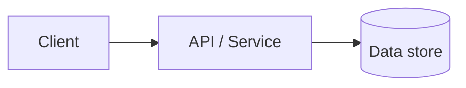

# {{title}} — Design

**Input**: Approved requirements for this spec.

## Summary

[Copy the Business Proposition from requirements. WHO benefits, WHAT they can do, WHY it matters — no technical details here.]

## Technical Context

**Language/Version**:
**Runtime**:
**Framework(s)**:
**Data store**:
**Cache / Queue / Streaming**: [Only if justified in requirements → Architectural Considerations]
**Testing**:
**Containerization / CI**:
**Performance goals**:
**Constraints / Scale**:

## Constitution / Standards Check

*GATE: Must pass before detailed design. Re-check after alternatives.*

- [ ] Module boundaries defined
- [ ] Auth / authorization approach agreed
- [ ] Error and logging conventions followed
- [ ] Health / readiness considered if deploying as a service
- [ ] Architectural decisions from requirements documented below

## Architecture

<!-- Components and how they interact. Always include at least one mermaid diagram. -->



## Data Model

<!-- Schemas, entities, relationships. Link to FR ids where useful. -->

## Interfaces / APIs

<!-- Endpoints, events, function signatures, contracts. -->

## Project Structure

```text
[Describe or sketch the directories/modules this design will touch]
```

## Alternatives Considered

| Option | Pros | Cons | Decision |
|---|---|---|---|
| | | | |

## Risks & Mitigations

| Risk | Impact | Mitigation |
|---|---|---|
| | | |

## Traceability

| Design decision | Requirement ids |
|---|---|
| | FR-001 |
