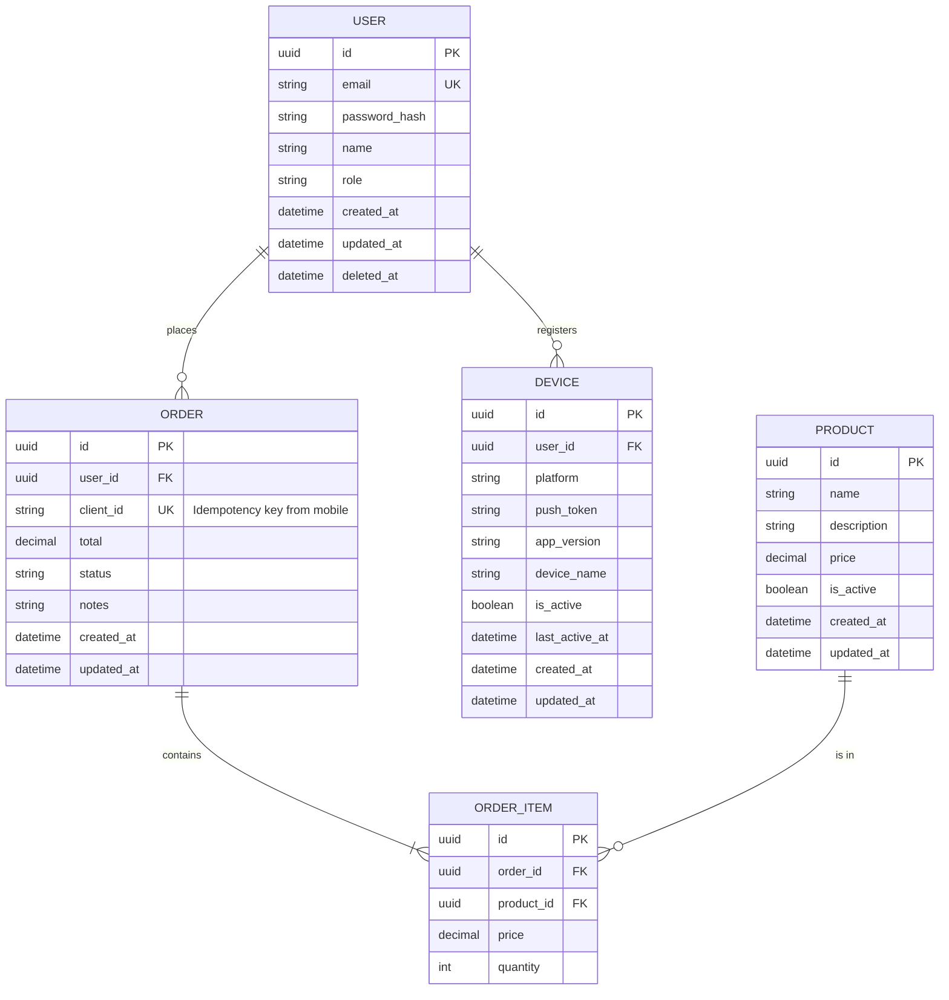

# Data Model: [FEATURE NAME]

**Input**: Feature specification from `/specs/[###-feature-name]/spec.md`
**ORM**: [SQLAlchemy 2.0+ (async) / Tortoise-ORM]
**Migration Tool**: Alembic
**Database**: PostgreSQL 16+
**Local Storage (Mobile)**: [MMKV / WatermelonDB / SQLite / Hive / Drift — if offline support needed]

## Entity Relationship Diagram



## Server Entities

### [Entity]: [Name]

**Table name**: `[table_name]`
**Purpose**: [What this entity represents]

| Column | Type | Constraints | Description |
|--------|------|-------------|-------------|
| `id` | `UUID` | PK, default: gen_random_uuid() | Primary identifier |
| `[column]` | `[type]` | [constraints] | [description] |
| `created_at` | `TIMESTAMP` | NOT NULL, default: NOW() | Creation timestamp |
| `updated_at` | `TIMESTAMP` | NOT NULL, default: NOW() | Last update (delta sync) |
| `deleted_at` | `TIMESTAMP` | NULL | Soft delete timestamp |

**Indexes**:
- `idx_[table]_[column]` on `[column]`
- `idx_[table]_updated_at` on `updated_at` — Required for delta sync queries

---

### Device (Required for Push Notifications)

**Table name**: `devices`
**Purpose**: Track registered mobile devices for push notifications

| Column | Type | Constraints | Description |
|--------|------|-------------|-------------|
| `id` | `UUID` | PK | Device registration ID |
| `user_id` | `UUID` | FK -> users.id, NOT NULL | Device owner |
| `platform` | `VARCHAR(10)` | NOT NULL, CHECK IN ('ios', 'android') | Device platform |
| `push_token` | `VARCHAR(512)` | NOT NULL, UNIQUE | FCM/APNs push token |
| `app_version` | `VARCHAR(20)` | NOT NULL | App version for compatibility |
| `device_name` | `VARCHAR(100)` | NULL | Human-readable device name |
| `is_active` | `BOOLEAN` | NOT NULL, default: true | Receives notifications |
| `last_active_at` | `TIMESTAMP` | NOT NULL, default: NOW() | Last activity |
| `created_at` | `TIMESTAMP` | NOT NULL, default: NOW() | Registration time |
| `updated_at` | `TIMESTAMP` | NOT NULL, default: NOW() | Last update |

**Indexes**:
- `idx_devices_user_id` on `user_id`
- `idx_devices_push_token` on `push_token` UNIQUE
- `idx_devices_user_active` on `(user_id, is_active)`

---

### Idempotency Record (Required for Offline Writes)

**Table name**: `idempotency_records`
**Purpose**: Track processed client requests for idempotent writes

| Column | Type | Constraints | Description |
|--------|------|-------------|-------------|
| `id` | `UUID` | PK | Record ID |
| `idempotency_key` | `VARCHAR(255)` | UNIQUE, NOT NULL | Client-provided key |
| `response_status` | `INTEGER` | NOT NULL | HTTP status of original response |
| `response_body` | `JSONB` | NOT NULL | Serialized response |
| `created_at` | `TIMESTAMP` | NOT NULL, default: NOW() | When processed |
| `expires_at` | `TIMESTAMP` | NOT NULL | Cleanup threshold |

---

## Mobile Local Models (if offline support needed)

### Mapping: Server Entity -> Local Model

| Server Entity | Local Model | Sync Strategy | Conflict Resolution |
|---------------|-------------|---------------|---------------------|
| `users` | `LocalUser` | Pull on login | Server wins |
| `orders` | `LocalOrder` | Bidirectional | Client timestamp wins |
| `products` | `LocalProduct` | Pull-only (read cache) | Server wins |

### Local Schema Example

```typescript
// React Native + WatermelonDB example
class Order extends Model {
  static table = 'orders';

  @text('server_id') serverId!: string;
  @text('client_id') clientId!: string;
  @text('status') status!: string;
  @json('sync_status') syncStatus!: 'synced' | 'pending' | 'failed';
  @date('server_updated_at') serverUpdatedAt!: Date;
  @readonly @date('created_at') createdAt!: Date;
  @readonly @date('updated_at') updatedAt!: Date;
}
```

## Migration Plan

### Migration 1: [Description]

```python
"""[description]

Revision ID: [auto-generated]
"""
from alembic import op
import sqlalchemy as sa


def upgrade() -> None:
    op.create_table(
        "[table_name]",
        sa.Column("id", sa.UUID(), primary_key=True, server_default=sa.text("gen_random_uuid()")),
        sa.Column("user_id", sa.UUID(), sa.ForeignKey("users.id", ondelete="CASCADE"), nullable=False),
        sa.Column("client_id", sa.String(255), unique=True, nullable=True),
        sa.Column("total", sa.Numeric(10, 2), nullable=False),
        sa.Column("status", sa.String(20), nullable=False, server_default="pending"),
        sa.Column("created_at", sa.DateTime(), nullable=False, server_default=sa.func.now()),
        sa.Column("updated_at", sa.DateTime(), nullable=False, server_default=sa.func.now()),
        sa.Column("deleted_at", sa.DateTime(), nullable=True),
    )
    op.create_index("idx_[table]_updated_at", "[table_name]", ["updated_at"])
    op.create_index("idx_[table]_user_id", "[table_name]", ["user_id"])


def downgrade() -> None:
    op.drop_index("idx_[table]_user_id")
    op.drop_index("idx_[table]_updated_at")
    op.drop_table("[table_name]")
```

## SQLAlchemy 2.0 Model Example

```python
from sqlalchemy import ForeignKey, Index, String, Numeric, func
from sqlalchemy.orm import Mapped, mapped_column, relationship
from src.database import Base
from datetime import datetime, timezone
from uuid import UUID, uuid4
from decimal import Decimal


class Order(Base):
    __tablename__ = "orders"
    __table_args__ = (
        Index("idx_orders_user_status", "user_id", "status"),
        Index("idx_orders_updated_at", "updated_at"),  # Required for delta sync
    )

    id: Mapped[UUID] = mapped_column(primary_key=True, default=uuid4)
    user_id: Mapped[UUID] = mapped_column(
        ForeignKey("users.id", ondelete="CASCADE"),
        index=True,
    )
    client_id: Mapped[str | None] = mapped_column(
        String(255), unique=True, doc="Idempotency key from mobile"
    )
    total: Mapped[Decimal] = mapped_column(Numeric(10, 2))
    status: Mapped[str] = mapped_column(String(20), server_default="pending")
    notes: Mapped[str | None] = mapped_column(String(500))
    created_at: Mapped[datetime] = mapped_column(server_default=func.now())
    updated_at: Mapped[datetime] = mapped_column(
        server_default=func.now(),
        onupdate=lambda: datetime.now(timezone.utc),
    )
    deleted_at: Mapped[datetime | None] = mapped_column(default=None)

    user: Mapped["User"] = relationship(back_populates="orders")
    items: Mapped[list["OrderItem"]] = relationship(
        back_populates="order",
        cascade="all, delete-orphan",
    )
```

## Pydantic Schema Mapping

```python
from pydantic import BaseModel, ConfigDict
from datetime import datetime
from uuid import UUID
from decimal import Decimal


class OrderResponse(BaseModel):
    model_config = ConfigDict(from_attributes=True)

    id: UUID
    user_id: UUID
    total: Decimal
    status: str
    notes: str | None
    created_at: datetime
    updated_at: datetime  # Required for delta sync
```

## Data Validation Rules

| Entity | Field | Rule | Error Code |
|--------|-------|------|------------|
| [Entity] | `email` | Valid email, unique | `EMAIL_ALREADY_EXISTS` |
| [Entity] | `name` | 1-255 chars | `NAME_REQUIRED` |
| Device | `push_token` | Non-empty, valid format | `INVALID_PUSH_TOKEN` |
| Device | `platform` | 'ios' or 'android' | `INVALID_PLATFORM` |

## Seed Data (Development)

```python
import asyncio
from src.database import async_session
from src.users.models import User
from src.devices.models import Device
from src.common.security import hash_password


async def seed() -> None:
    async with async_session() as session:
        admin = User(
            email="admin@example.com",
            password_hash=hash_password("admin123"),
            name="Admin User",
            role="admin",
        )
        user = User(
            email="user@example.com",
            password_hash=hash_password("user123"),
            name="Test User",
            role="user",
        )
        session.add_all([admin, user])
        await session.flush()

        # Test devices
        session.add_all([
            Device(user_id=admin.id, platform="ios", push_token="test-ios", app_version="1.0.0"),
            Device(user_id=user.id, platform="android", push_token="test-android", app_version="1.0.0"),
        ])
        await session.commit()


if __name__ == "__main__":
    asyncio.run(seed())
```
