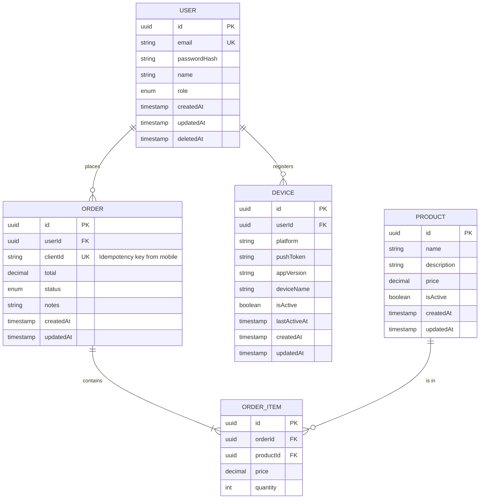

# Data Model: [FEATURE NAME]

**Input**: Feature specification from `/specs/[###-feature-name]/spec.md`
**ORM**: [TypeORM / Prisma]
**Database**: PostgreSQL 16+
**Local Storage (Mobile)**: [MMKV / WatermelonDB / SQLite / Hive / Drift — if offline support needed]

## Entity Relationship Diagram



## Server Entities

### [Entity]: [Name]

**Table name**: `[table_name]`
**Purpose**: [What this entity represents]

| Column | Type | Constraints | Description |
|--------|------|-------------|-------------|
| `id` | `uuid` | PK, default: gen_random_uuid() | Primary identifier |
| `[column]` | `[type]` | [constraints] | [description] |
| `created_at` | `timestamp` | NOT NULL, default: NOW() | Creation timestamp |
| `updated_at` | `timestamp` | NOT NULL, default: NOW() | Last update (used for delta sync) |
| `deleted_at` | `timestamp` | NULL | Soft delete timestamp |

**Indexes**:
- `idx_[table]_[column]` on `[column]`
- `idx_[table]_updated_at` on `updated_at` — Required for delta sync queries

**Relations**:
- [relation_type] to [other_entity] via [foreign_key]

---

### Device (Required for Push Notifications)

**Table name**: `devices`
**Purpose**: Track registered mobile devices for push notifications

| Column | Type | Constraints | Description |
|--------|------|-------------|-------------|
| `id` | `uuid` | PK | Device registration ID |
| `user_id` | `uuid` | FK -> users.id, NOT NULL | Device owner |
| `platform` | `varchar(10)` | NOT NULL, CHECK IN ('ios', 'android') | Device platform |
| `push_token` | `varchar(512)` | NOT NULL | FCM/APNs push token |
| `app_version` | `varchar(20)` | NOT NULL | App version for compatibility tracking |
| `device_name` | `varchar(100)` | NULL | Human-readable device name |
| `is_active` | `boolean` | NOT NULL, default: true | Whether device should receive notifications |
| `last_active_at` | `timestamp` | NOT NULL, default: NOW() | Last time device was seen |
| `created_at` | `timestamp` | NOT NULL, default: NOW() | Registration timestamp |
| `updated_at` | `timestamp` | NOT NULL, default: NOW() | Last update timestamp |

**Indexes**:
- `idx_devices_user_id` on `user_id` — Query devices by user
- `idx_devices_push_token` on `push_token` UNIQUE — Prevent duplicate registrations
- `idx_devices_user_active` on `(user_id, is_active)` — Active devices for push delivery

---

### Idempotency Record (Required for Offline Writes)

**Table name**: `idempotency_records`
**Purpose**: Track processed client requests for idempotent write operations

| Column | Type | Constraints | Description |
|--------|------|-------------|-------------|
| `id` | `uuid` | PK | Record ID |
| `idempotency_key` | `varchar(255)` | UNIQUE, NOT NULL | Client-provided idempotency key |
| `response_status` | `integer` | NOT NULL | HTTP status of original response |
| `response_body` | `jsonb` | NOT NULL | Serialized response body |
| `created_at` | `timestamp` | NOT NULL, default: NOW() | When request was first processed |
| `expires_at` | `timestamp` | NOT NULL | When this record can be cleaned up |

**Indexes**:
- `idx_idempotency_key` on `idempotency_key` UNIQUE — Fast lookup
- `idx_idempotency_expires` on `expires_at` — Cleanup job

---

## Mobile Local Models (if offline support needed)

### Mapping: Server Entity -> Local Model

| Server Entity | Local Model | Sync Strategy | Conflict Resolution |
|---------------|-------------|---------------|---------------------|
| `users` | `LocalUser` | Pull on login | Server wins |
| `orders` | `LocalOrder` | Bidirectional | Client timestamp wins |
| `products` | `LocalProduct` | Pull-only (read cache) | Server wins |
| `devices` | N/A | N/A | N/A |

### Local Schema Example (WatermelonDB / SQLite)

```typescript
// React Native + WatermelonDB example
class Order extends Model {
  static table = 'orders';
  static associations = {
    order_items: { type: 'has_many', foreignKey: 'order_id' },
  };

  @text('server_id') serverId!: string;        // Maps to server UUID
  @text('client_id') clientId!: string;         // Local UUID for idempotency
  @text('status') status!: string;
  @json('sync_status') syncStatus!: 'synced' | 'pending' | 'failed';
  @date('server_updated_at') serverUpdatedAt!: Date;
  @readonly @date('created_at') createdAt!: Date;
  @readonly @date('updated_at') updatedAt!: Date;
}
```

## Migration Plan

### Migration 1: [Description]

```sql
-- UP
CREATE TABLE [table_name] (
  id UUID PRIMARY KEY DEFAULT gen_random_uuid(),
  -- columns...
  created_at TIMESTAMP NOT NULL DEFAULT NOW(),
  updated_at TIMESTAMP NOT NULL DEFAULT NOW()
);

CREATE INDEX idx_[table]_updated_at ON [table_name](updated_at);

-- DOWN
DROP TABLE IF EXISTS [table_name];
```

## TypeORM Entity Example

```typescript
@Entity('orders')
@Index(['userId', 'status'])
@Index(['updatedAt'])  // Required for delta sync
export class Order {
  @PrimaryGeneratedColumn('uuid')
  id: string;

  @Column('uuid')
  @Index()
  userId: string;

  @Column({ type: 'varchar', length: 255, unique: true, nullable: true })
  clientId: string;  // Idempotency key from mobile

  @Column({ type: 'decimal', precision: 10, scale: 2 })
  total: number;

  @Column({ type: 'enum', enum: OrderStatus, default: OrderStatus.PENDING })
  status: OrderStatus;

  @CreateDateColumn()
  createdAt: Date;

  @UpdateDateColumn()
  updatedAt: Date;

  @DeleteDateColumn()
  deletedAt?: Date;
}
```

## Data Validation Rules

| Entity | Field | Rule | Error Code |
|--------|-------|------|------------|
| [Entity] | `email` | Valid email, unique | `EMAIL_ALREADY_EXISTS` |
| [Entity] | `name` | 1-255 chars | `NAME_REQUIRED` |
| Device | `pushToken` | Non-empty, valid format | `INVALID_PUSH_TOKEN` |
| Device | `platform` | 'ios' or 'android' | `INVALID_PLATFORM` |

## Seed Data (Development)

```typescript
const seedData = {
  users: [
    { email: 'admin@example.com', name: 'Admin User', role: 'ADMIN' },
    { email: 'user@example.com', name: 'Test User', role: 'USER' },
  ],
  devices: [
    { userId: '<admin-id>', platform: 'ios', pushToken: 'test-token-ios', appVersion: '1.0.0' },
    { userId: '<user-id>', platform: 'android', pushToken: 'test-token-android', appVersion: '1.0.0' },
  ],
};
```
