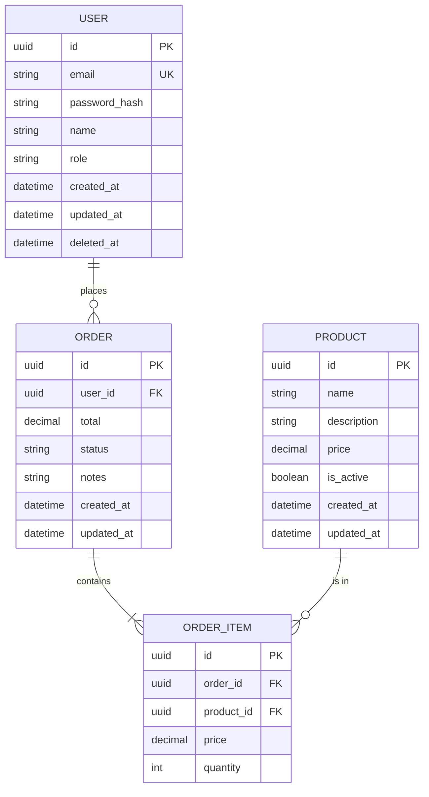

# Data Model: [FEATURE NAME]

**Input**: Feature specification from `/specs/[###-feature-name]/spec.md`
**ORM**: [SQLAlchemy 2.0+ (async) / Tortoise-ORM]
**Migration Tool**: Alembic
**Database**: PostgreSQL 16+

## Entity Relationship Diagram



## Entities

### [Entity 1]: [Name]

**Table name**: `[table_name]`
**Purpose**: [What this entity represents in the domain]

| Column | Type | Constraints | Description |
|--------|------|-------------|-------------|
| `id` | `UUID` | PK, default: gen_random_uuid() | Primary identifier |
| `[column]` | `[type]` | [constraints] | [description] |
| `created_at` | `TIMESTAMP` | NOT NULL, default: NOW() | Creation timestamp |
| `updated_at` | `TIMESTAMP` | NOT NULL, default: NOW() | Last update timestamp |
| `deleted_at` | `TIMESTAMP` | NULL | Soft delete timestamp |

**Indexes**:
- `idx_[table]_[column]` on `[column]` — [justification]
- `idx_[table]_[col1]_[col2]` on `([col1], [col2])` — [justification]

**Relations**:
- `[relation_type]` to `[other_entity]` via `[foreign_key]` — ON DELETE [CASCADE/SET NULL/RESTRICT]

---

### [Entity 2]: [Name]

**Table name**: `[table_name]`
**Purpose**: [What this entity represents]

| Column | Type | Constraints | Description |
|--------|------|-------------|-------------|
| `id` | `UUID` | PK, default: gen_random_uuid() | Primary identifier |
| `[column]` | `[type]` | [constraints] | [description] |

---

[Add more entities as needed]

## Enumerations

### [EnumName]

| Value | Description |
|-------|-------------|
| `VALUE_1` | [description] |
| `VALUE_2` | [description] |
| `VALUE_3` | [description] |

## Migration Plan

### Migration 1: [Description]

**File**: `alembic/versions/[revision]_[description].py`

```python
"""[description]

Revision ID: [auto-generated]
"""

from alembic import op
import sqlalchemy as sa


def upgrade() -> None:
    op.create_table(
        "[table_name]",
        sa.Column("id", sa.UUID(), primary_key=True, server_default=sa.text("gen_random_uuid()")),
        sa.Column("user_id", sa.UUID(), sa.ForeignKey("users.id", ondelete="CASCADE"), nullable=False),
        sa.Column("total", sa.Numeric(10, 2), nullable=False),
        sa.Column("status", sa.String(20), nullable=False, server_default="pending"),
        sa.Column("created_at", sa.DateTime(), nullable=False, server_default=sa.func.now()),
        sa.Column("updated_at", sa.DateTime(), nullable=False, server_default=sa.func.now()),
        sa.Column("deleted_at", sa.DateTime(), nullable=True),
    )
    op.create_index("idx_[table]_[column]", "[table_name]", ["[column]"])


def downgrade() -> None:
    op.drop_index("idx_[table]_[column]")
    op.drop_table("[table_name]")
```

## SQLAlchemy 2.0 Model Example

```python
from sqlalchemy import ForeignKey, Index, String, Numeric, func
from sqlalchemy.orm import Mapped, mapped_column, relationship
from src.database import Base
from datetime import datetime, timezone
from uuid import UUID, uuid4
from decimal import Decimal


class Order(Base):
    __tablename__ = "orders"
    __table_args__ = (
        Index("idx_orders_user_status", "user_id", "status"),
    )

    id: Mapped[UUID] = mapped_column(primary_key=True, default=uuid4)
    user_id: Mapped[UUID] = mapped_column(
        ForeignKey("users.id", ondelete="CASCADE"),
        index=True,
    )
    total: Mapped[Decimal] = mapped_column(Numeric(10, 2))
    status: Mapped[str] = mapped_column(String(20), server_default="pending")
    notes: Mapped[str | None] = mapped_column(String(500))
    created_at: Mapped[datetime] = mapped_column(server_default=func.now())
    updated_at: Mapped[datetime] = mapped_column(
        server_default=func.now(),
        onupdate=lambda: datetime.now(timezone.utc),
    )
    deleted_at: Mapped[datetime | None] = mapped_column(default=None)

    # Relationships (lazy="selectin" for async compatibility)
    user: Mapped["User"] = relationship(back_populates="orders")
    items: Mapped[list["OrderItem"]] = relationship(
        back_populates="order",
        cascade="all, delete-orphan",
    )
```

## Pydantic Schema Mapping

```python
from pydantic import BaseModel, ConfigDict
from datetime import datetime
from uuid import UUID
from decimal import Decimal


class OrderResponse(BaseModel):
    """Maps to Order SQLAlchemy model for API responses."""
    model_config = ConfigDict(from_attributes=True)

    id: UUID
    user_id: UUID
    total: Decimal
    status: str
    notes: str | None
    created_at: datetime
    updated_at: datetime
    items: list["OrderItemResponse"] = []
```

## Data Validation Rules

| Entity | Field | Rule | Error Message |
|--------|-------|------|---------------|
| [Entity] | `email` | Valid email format, unique | "Email is already registered" |
| [Entity] | `name` | 1-255 characters, not blank | "Name is required" |
| [Entity] | `price` | > 0, max 2 decimal places | "Price must be positive" |

## Seed Data (Development)

```python
# src/seed.py
import asyncio
from src.database import async_session
from src.users.models import User
from src.common.security import hash_password


async def seed() -> None:
    async with async_session() as session:
        admin = User(
            email="admin@example.com",
            password_hash=hash_password("admin123"),
            name="Admin User",
            role="admin",
        )
        user = User(
            email="user@example.com",
            password_hash=hash_password("user123"),
            name="Test User",
            role="user",
        )
        session.add_all([admin, user])
        await session.commit()


if __name__ == "__main__":
    asyncio.run(seed())
```
