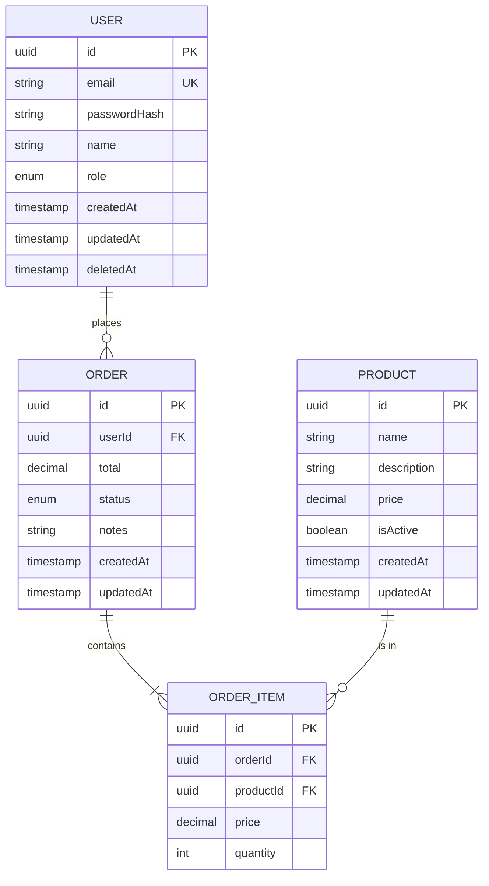

# Data Model: [FEATURE NAME]

**Input**: Feature specification from `/specs/[###-feature-name]/spec.md`
**ORM**: [TypeORM / Prisma]
**Database**: PostgreSQL 16+

## Entity Relationship Diagram

<!--
  Include a text-based ERD or reference a diagram tool output.
  Use Mermaid syntax for GitHub rendering:
-->



## Entities

### [Entity 1]: [Name]

**Table name**: `[table_name]`
**Purpose**: [What this entity represents in the domain]

| Column | Type | Constraints | Description |
|--------|------|-------------|-------------|
| `id` | `uuid` | PK, default: gen_random_uuid() | Primary identifier |
| `[column]` | `[type]` | [constraints] | [description] |
| `createdAt` | `timestamp` | NOT NULL, default: NOW() | Creation timestamp |
| `updatedAt` | `timestamp` | NOT NULL, default: NOW() | Last update timestamp |
| `deletedAt` | `timestamp` | NULL | Soft delete timestamp |

**Indexes**:
- `idx_[table]_[column]` on `[column]` — [justification: frequently queried/filtered]
- `idx_[table]_[col1]_[col2]` on `([col1], [col2])` — [justification: composite query]

**Relations**:
- `[relation_type]` to `[other_entity]` via `[foreign_key]` — ON DELETE [CASCADE/SET NULL/RESTRICT]

---

### [Entity 2]: [Name]

**Table name**: `[table_name]`
**Purpose**: [What this entity represents]

| Column | Type | Constraints | Description |
|--------|------|-------------|-------------|
| `id` | `uuid` | PK, default: gen_random_uuid() | Primary identifier |
| `[column]` | `[type]` | [constraints] | [description] |
| `createdAt` | `timestamp` | NOT NULL, default: NOW() | Creation timestamp |
| `updatedAt` | `timestamp` | NOT NULL, default: NOW() | Last update timestamp |

---

[Add more entities as needed]

## Enumerations

### [EnumName]

| Value | Description |
|-------|-------------|
| `VALUE_1` | [description] |
| `VALUE_2` | [description] |
| `VALUE_3` | [description] |

## Migration Plan

### Migration 1: [Description]

**File**: `src/migrations/[timestamp]-[name].ts`

```sql
-- UP
CREATE TABLE [table_name] (
  id UUID PRIMARY KEY DEFAULT gen_random_uuid(),
  -- columns...
  created_at TIMESTAMP NOT NULL DEFAULT NOW(),
  updated_at TIMESTAMP NOT NULL DEFAULT NOW()
);

CREATE INDEX idx_[table]_[column] ON [table_name]([column]);

-- DOWN
DROP TABLE IF EXISTS [table_name];
```

### Migration 2: [Description]

**File**: `src/migrations/[timestamp]-[name].ts`

```sql
-- UP
ALTER TABLE [table_name] ADD COLUMN [column] [type] [constraints];

-- DOWN
ALTER TABLE [table_name] DROP COLUMN [column];
```

## TypeORM Entity Example

```typescript
import {
  Entity, PrimaryGeneratedColumn, Column, CreateDateColumn,
  UpdateDateColumn, DeleteDateColumn, ManyToOne, Index, JoinColumn,
} from 'typeorm';

@Entity('[table_name]')
@Index(['[column1]', '[column2]'])
export class [EntityName] {
  @PrimaryGeneratedColumn('uuid')
  id: string;

  @Column({ type: 'varchar', length: 255 })
  name: string;

  @Column({ type: 'decimal', precision: 10, scale: 2 })
  price: number;

  @Column({ type: 'enum', enum: [EnumName], default: [EnumName].DEFAULT })
  status: [EnumName];

  @ManyToOne(() => [RelatedEntity], { onDelete: 'CASCADE' })
  @JoinColumn({ name: '[foreignKey]' })
  [relation]: [RelatedEntity];

  @Column('uuid')
  @Index()
  [foreignKey]: string;

  @CreateDateColumn()
  createdAt: Date;

  @UpdateDateColumn()
  updatedAt: Date;

  @DeleteDateColumn()
  deletedAt?: Date;
}
```

## Prisma Schema Example

```prisma
model [EntityName] {
  id        String   @id @default(uuid())
  name      String   @db.VarChar(255)
  price     Decimal  @db.Decimal(10, 2)
  status    [EnumName] @default(DEFAULT)

  [relation]   [RelatedEntity] @relation(fields: [[foreignKey]], references: [id], onDelete: Cascade)
  [foreignKey]  String

  createdAt DateTime @default(now())
  updatedAt DateTime @updatedAt
  deletedAt DateTime?

  @@index([[foreignKey]])
  @@index([status, createdAt])
  @@map("[table_name]")
}

enum [EnumName] {
  VALUE_1
  VALUE_2
  VALUE_3
}
```

## Data Validation Rules

| Entity | Field | Rule | Error Message |
|--------|-------|------|---------------|
| [Entity] | `email` | Valid email format, unique | "Email is already registered" |
| [Entity] | `name` | 1-255 characters, not blank | "Name is required" |
| [Entity] | `price` | > 0, max 2 decimal places | "Price must be positive" |

## Seed Data (Development)

<!--
  Define initial data needed for development and testing.
-->

```typescript
const seedData = {
  users: [
    { email: 'admin@example.com', name: 'Admin User', role: 'ADMIN' },
    { email: 'user@example.com', name: 'Test User', role: 'USER' },
  ],
  // Add more seed data...
};
```
